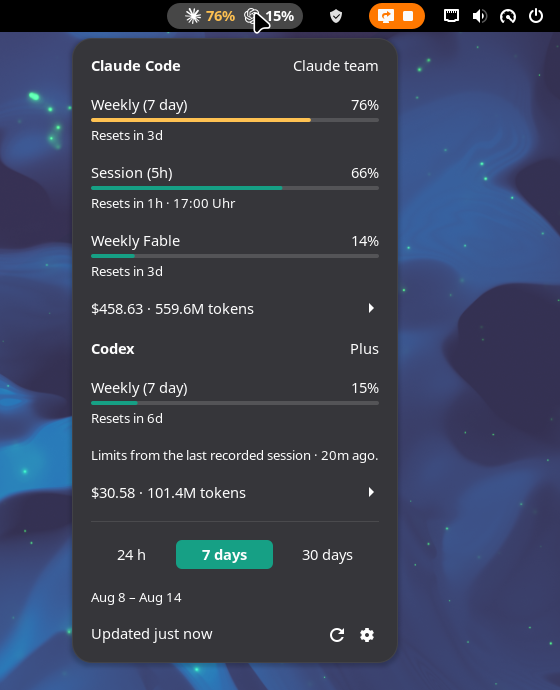

# Claudex Usage — Claude Code & Codex usage and cost in the GNOME panel

A GNOME Shell extension for **Claude Code** and **OpenAI Codex** that answers both questions from
the top panel: how much of your limits is left, and **where the spend actually went** — what the
same traffic would have cost at API rates, broken down per model, per skill, per subagent and per
MCP tool.

Every other panel extension in this space stops at the first question. This one is for when
"73% used" is not the thing you wanted to know.

Works with Claude Code alone, Codex alone, or both. Everything is read from the session files
already on your machine; nothing is sent anywhere.

Tested on GNOME 49 and 50, Wayland and X11, Arch/Manjaro, Fedora and Ubuntu.

<p align="center">
  
</p>

## What it shows

- **Limits** — every rolling limit with a bar: Claude's 5-hour session, weekly and weekly-Opus
  quota, Codex's 5-hour and weekly quota. The same figures `/usage` reports inside Claude Code.
- **Resets** — how long until each limit refills ("Resets in 4h").
- **Cost at API rates** — what the last 24 hours / 7 days / 30 days would have cost at API list
  prices, plus what prompt caching saved. A subscription is flat-rate, so this is not a bill.
- **Where it went** — cost per model, and the share spent under each skill, subagent and MCP tool.
- **In the panel** — the tightest limit's percentage, the window's cost, or just the icon.

## Install

Needs GNOME Shell 49 or 50. Grab the zip from the
[latest release](https://github.com/TheSalaty/claude-codex-usage-gnome-extension/releases/latest):

```sh
gnome-extensions install --force claudex-usage@thesalaty.github.io.shell-extension.zip
```

Or from source, which needs Node 20+:

```sh
git clone https://github.com/TheSalaty/claude-codex-usage-gnome-extension.git
cd claude-codex-usage-gnome-extension
npm install
make install
```

Then log out and back in — Wayland cannot reload the shell in place — and enable it:

```sh
gnome-extensions enable claudex-usage@thesalaty.github.io
```

`make pack` builds a `.shell-extension.zip` instead.

## Settings

Open with the gear in the menu, or `gnome-extensions prefs claudex-usage@thesalaty.github.io`.

| | |
|---|---|
| **Panel button shows** | Limit %, cost, or icon only |
| **Limit percentage shows** | Claude, Codex, or both |
| **Cost window** | Past 24 hours, 7 days or 30 days |
| **Refresh interval** | 60–3600 seconds between collections |

Prices come from a built-in list ([`src/lib/pricing.ts`](src/lib/pricing.ts), USD per million
tokens). Override any model by creating `~/.config/claudex-usage/pricing.json` — the longest
matching model-id prefix wins:

```json
{
  "gpt-5.6": { "input": 1.25, "output": 10 },
  "claude-opus": { "input": 5, "output": 25, "cacheReadFactor": 0.1 }
}
```

## Notes

- **Claude's OAuth token is read, never refreshed.** If it has expired the menu says so and keeps
  showing cost; start Claude Code once and it refreshes itself.
- **Codex has no usage endpoint.** Its limits come from the snapshot in the last session it ran, so
  the menu labels them with their age. Run Codex and they update.

## Compared with the other usage extensions

There are a dozen of these now, so here is an honest table. Feature sets are from each project's
own README, checked in August 2026.

| | Claude | Codex | Limits & resets | Cost at API rates | Per model / skill / subagent | GNOME |
|---|---|---|---|---|---|---|
| **Claudex Usage** (this) | ✅ | ✅ | ✅ | ✅ | ✅ | 49–50 |
| [Brain Usage](https://github.com/AltairInglorious/brainusage) | ✅ | ✅ | ✅ | — | — | 45–49 |
| [AI Usage Bar](https://github.com/wilfison/ai-usagebar) | ✅ | ✅ | ✅ | — | — | 50 |
| [Claude + Codex Usage](https://github.com/IanBraga96/gnome-claude-codex-usage) | ✅ | ✅ | ✅ | — | — | 48–50 |
| [Claude Monitor](https://github.com/CybrosysAssista/claude-monitor) | ✅ | ✅ | ✅ | — | — | 45–49 |
| [AI Token Bars](https://github.com/fen22/gnome-shell-extension-ai-token-bars) | ✅ | ✅ | ✅ | — | — | 42 |
| [claude-monitor](https://github.com/miferco97/claude-monitor-gnome-extension) | ✅ | — | ✅ | cost + burn rate | — | 48 |
| [CodexBar](https://github.com/steipete/CodexBar) wrappers | ✅ | ✅ | ✅ | some | — | varies |

Where the others are ahead, so you can pick properly: **AI Usage Bar** covers four more vendors
(Z.AI, OpenRouter, DeepSeek, Kimi). **Brain Usage** ships a KDE Plasma version and low-quota
notifications. **Claude Monitor** has a macOS menu-bar app. If limits are all you need and you are
on GNOME 45–48, those are the better fit — this one starts at 49.

What is here and nowhere else is the second half of the question: cost at API list prices for the
last 24h / 7d / 30d, what prompt caching saved, and the split across models, skills, subagents and
MCP tools. Also no helper CLI or daemon — the CodexBar-based ones need its binary installed and
current; this reads the session files directly.

Building on this? See [docs/DEVELOPMENT.md](docs/DEVELOPMENT.md).

## Licence

MIT
